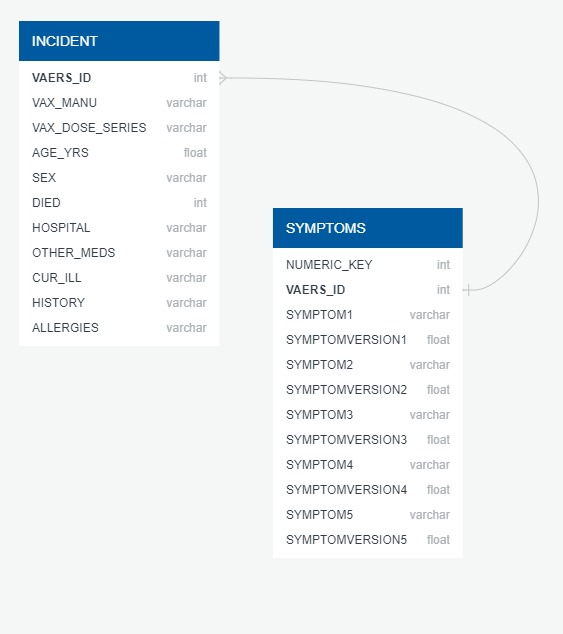
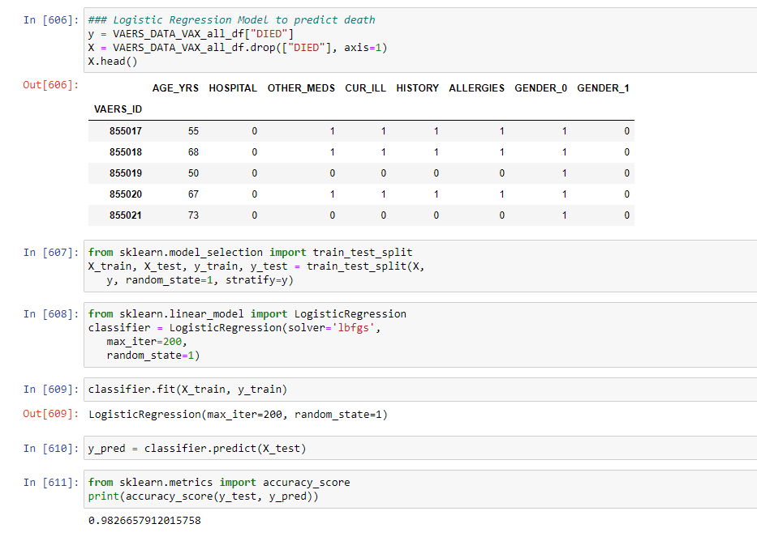

# Vaccine Adverse Event Reporting System (VAERS)

## Introduction
The Food and Drug Administration (FDA) and Centers for Disease Control and Prevention (CDC) established the Vaccine Adverse Event Reporting System (VAERS) to receive reports about adverse events that may be associated with vaccines.

The dataset(s) we are utilizing are provided by this organization and consist of (3) related .CSV files, each indexed by a patient ID and consisting of nearly 52,000 records providing various details about the adverse event experienced by the vaccine recipients of the Covid-19 vaccine from PFizer and Moderna starting in 2020 through the first quarter of 2021.

This project is established to answer the following question,
> Assuming an adverse reaction to one of the Covid-19 vaccines from PFizer or Moderna, does having a pre-existing condition, taking additional medications or having allergies increase the likelihood of death or hospitalization for age group or sex?

## Team Members
 - Rima Mehra will be responsible for generating the Entity Relationship Diagram (ERD) and initial SQL statements to create tables.  Please refer to Rima's branch, "Rima" for view of these deliverables.

 - Vitaly Bourenin will generate the initial machine learning model and connection string to the postgres database from python.  Following is the link to a python file which demonstrates connection strings and machine learning model:  [Python_File](https://github.com/zoomdmartin02/final_project_team11/blob/Vitaly/Model_team11.ipynb).  Please also refer to branch, "Vitaly" for a direct view of these deliverables.

 - David Martin is responsible for the GitHub repositories and will setup the AWS PostgreSQL database and generate the ReadMe.MD and a draft of the Google Slides presentation.  [Segment1_Presentation](https://github.com/zoomdmartin02/final_project_team11/blob/main/Presentation%20Draft%20Segment%201%20-%20Adverse%20Reactions%20to%20Covid-19%20Vaccines.pdf).  Please see branch, "David" if needed, although these deliverables were merged into the "Main" branch.

 ## Communication Channels
 The team will primarily communicate through Slack.  A TEAM 11 channel has been established and all team members are members and have verified communciation capability on the channel.

 Each team member has also provided cell phone numbers, email addresses and GitHub userids.

 The team has agreed to meet nightly this past week at 8PM for a check-in and review of each other's progress, to assist each other and generally ensure all are collaborating on each deliverable.

 ## Data Source
 The VAERS data was originally discoverd on Kaggle.com.  However, a more thorough search allowed the team to discover that a greater amount of data was available at [VAERS_Data](https://vaers.hhs.gov/data.html).  The downloadable data entails (2) zip file downloads for 2020 vaersdata and 2021 vaersdata.  Each zip file contains (3) .csv files:
 1. 2020VAERSDATA.CSV
 2. 2020VAERSSYMPTOMS.CSV
 3. 2020VARESVAX.CSV
 4. 2021VAERSDATA.CSV
 5. 2021VAERSSYMPTOMS.CSV
 6. 2021VARESVAX.CSV

 ## Technologies

 ### Data Storage
 The team has agreed to use PostgreSQL, hosted on Amazon AWS.  The follwoing ERD references two primary tables that we will utilize for multiple analyses.  

 

After cleaning data, the Incident Table is the primary table we are doing initial analysis and machine learning for in order to evaluate predictability of death as an adverse reaction when pre-existing conditions are a factor.

The Symptoms table will need further development and may serve as an opportunity to perform unsupervised learning to see if there are any clusters based on symptom type that result in death or hospitalization.

 ### Machine Learning
 The Machine Learning Module utilized for our initial analysis is Supervised Learning:  Logistic Regression.  We believe further analysis of symptom data will allow for further analysis using Unsupervised Machine Learing.  Python libraries expected are:
 - pandas, 
 - numpy
 - hvplot, 
 - plotly
 - plotly.express
 - sklearn (KMeans, StandardScaler, MinMaxScaler and PCA)

 
 
 ### Visualization
 Tableau will be the primary visualization tool to present our findings.