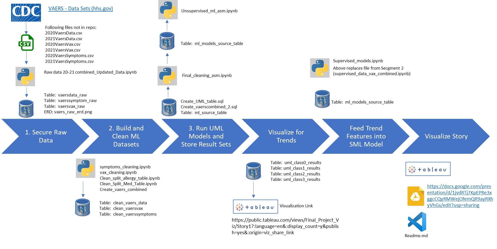

### COVID-19 Vaccine Research

Our Project is about trying to predict if a person taking a COVID vaccine is going to have a serious adverse reaction or not given features such as existing allergies, current medication, age and gender. To help solve this question, we will put our data set through a process of cleaning and normalizing and first run the data through an unsupervised machine learning model to determine whether there are any patterns or clusters in the data.  The clustered data will be summarized and visualized with the hope of finding trends that we can then inform our supervised machine learning model, a logistic regression to answer the question.

A high level view of the project flow and progression is as follows:

NOTE:  This same map is provided at the bottom of the ReadMe to provide file names that should be present in the Main branch for each step in the associated project flow diagram.

Please visit our [Google Slide Presentation](https://docs.google.com/presentation/d/1jvdRTj7KpEPRe3xggcCQyRMWejOfemQR9ayRXhyVhGs/edit?usp=sharing) for more details. 

## Data Source
 - Our data source is from HHS Vaers website - [Data Source](https://vaers.hhs.gov/data/datasets.html?)
 - We downloaded the latest available data for 2020 and 2021
 - To support the machine learning and visualization activities, the database will build off of the original three CSV files. Each of these  files were written to the database in their original form and named as follows:
  - VAERS_Data_Raw
  - VAERS_Symptom_Raw
  - VAERS_Vax_Raw
- These files were then pulled into python by various team members and cleaned in preparation for machine learning activities. 
- “vaers_raw_erd.png” in the main branch is the Entity Relationship Diagram that is the basis for all of our database joins 
 in any of the subsequent tables that are created.  
- The three tables each have a VAERS_ID column and are joined with a 1-many relationship from VAERS_VAX_RAW to VAERS_DATA_RAW and a 1-many relationship from VAERS_VAX_RAW to VAERS_SYMPTOM_RAW as well.

## Data Cleaning

### Cleaning for VAERS_Symptoms_Raw
VAERS Symptoms was fairly well organized as structured data with essentially 5 useful columns of symptom data. Each column row is a single value. However, there are many duplicate VAERS IDs. The highest frequency of documented symptoms for a single patient is 120 symptoms.  That's 24 rows of symptom data for that 1 patient.

To prepare for machine learning, we believed the data needed to be a single value per column, but all duplicate rows needed to be removed. It seems that the original data collection solution only allowed for 5 symptoms per patient.  So, if there were more than 5 symptoms reported, the same vaers_id would be duplicated on the next line.  So, one patient had 24 successive lines of symptom data.  The goal was accomplished by merging the five columns into a single column with a list of five values. Next, a lambda function that leverages the join method to find all duplicate rows and merge their 5 symptoms into the first occurrence of the duplicated VAERS ID. 

Now the symptoms data had been transformed to a dataframe with unique VAERS_IDs and each row with a single list of symptoms, with as many as 120 values in the list. Next, the values in the lists were split into individual columns. This would allow these text columns to be encoded during the machine learning process.  This was done by creating an iterration to iterate through the dataframe and on each row, loop through the symptoms in the symptom list and create a columen, SYMPTOM1, SYMPTOM2, and so on all the way to SYMPTOM 120.  Of course, after column SYMPTOM5, the remaining columns contained mostly null values.
Please see “symptoms_cleaning.ipynb” to review related python code.

### Cleaning for VAERS_Data_Raw
VAERS_Data_Raw has many data elements of interest including basic demographics for each patient and other useful information such as medical history, allergies and other medications. Aside from utilizing the demographic information, allergies and other medication information are part of the needed data set to support our machine learning models. Both allergies data and other medications data were also documented in a single column with multiple entries per row. This data also had to be split and placed in columns in a 1:1 ratio between column and allergy or medication values.

To prepare for our machine learning model, we had to create an allergy table and scrub out all the bad data. We started with a merged file of VAERS_Data_Raw and VAERS_Vax_Raw called vaerscombined_2 so as to eliminate rows that were non COVID-19 related. We then dropped the non essential columns and were left with vaers_id and Allergy.

We then used a lambda function to split the allergy column using a delimeter and after scrubbing down all non-essential values we created our Allergy table and saved it to our database. Please see “Clean_Split_Allergy_Table.ipynb” to review related python code.

<!-- [Vitaly to reference python file for medications cleaning] -->

### Cleaning for VAERS_Vax_Raw
This data set listed the VAERS_ID and vaccine information such as the vaccine manufacturer, dose lot and dose series. These features too were believed to be relevant to our planned models. Cleaning this table however was relatively easy as it was already setup with no duplicate VAERS_ID values. A subset of this data is all that was needed as it included many other vaccines besides COVID-19. Our study is relevant to only COVID-19 and this is the subset of vaccine information that we gathered.

Please see vax_cleaning.ipynb in the main branch for coding details.

These tables were saved in the database as clean_vaers_vax, clean_vaers_data and clean_vaers_symptom. In the database, they were joined with left outer joins to VAERS_VAX. Please see “create_uml_table.sql’ in the main branch to review the database joins in preparation for unsupervised machine learning activities.

## Machine Learning

The planned method for analyzing the VAERS data through machine learning is a two-step process:

### Step 1: Unsupervised Learning
The goal of unsupervised learning is to determine whether there are any patterns or clusters with the data from which insights about the data can be gained. Many data analysts will leverage machine learning to gain insights and from those insights create a supervised learning model where predictive value can be achieved. From this, we hope to answer questions such as, “is there possibly a link to death, hospitalization or life-threatening circumstances that arise because a patient has a particular allergy or is on a particular medication?”. 

#### Description of Data PreProcessing
Initial data cleaning and processing mentioned above was mostly to combine data bring it as much as possible into a structured state from its original unstructured state.  While symptoms data was cleaned in the symptoms_cleaning.ipynb and for the most part made ready for machine learning, the allergy and medication data was a long way from being ready for machine learning.

The allergy and medication data had to be processed further to normalize it.  First, data had to be converted to all upper case since there was variation in the data by case.  For example, "Penicillan" appeared as PENICILLIN and as Penicillin.  Second, There were occurrences of spaces in the data that were creating variation.  String functions like str.upper and str.rtrim were leveraged to tackle these variations.  Additonally, the same answer could appear in many forms, spellings or additional anecdotal information.  Penicillin was listed in the data as: [penacillin, pnc, penicilin, penicillin - rash, severe allergy to penicillin, penicillian, allergic to penicillin, and so on...]  To fix this, these variations were cataloged and put in a list and a dataframe replace function was leveraged to replace all variations with a single form of PENICILLIN.

This same situation occurred with the medications and the same actions were taken.  However, in addition, we believed that medications an individual might be linked to adverse reactions, so instead of just leaving the normalized medications in a long vertical column, we believed it would be more appropriate to organize the medications as a boolean value in an individual medication column.  To do this, we used Numpy where() function to examine whether a sub-string was contained in the Med-1 column or row and then used to replace all values with a "Y" or "N".  This again was done by iterating through a lengthy list of specific medications (reflecting the majority of all named medications) that we wanted to examine closely and applying the where() function on while the specific drug had the focus in the iterration.  By selecting a specific list of medications and determining if they were present in the Med_1 column as a substring, we were able to remove a lot of noise and varied data in the medications feature.

#### Description of Feature Engineering, Selection and Decision-Making Process
Feature engineering is touched on lightly in the above paragraph as the data preprocessing is examined.  Generally, although categorical data of a boolean format is harder to visualize, we believe that our symptoms, medication and allergy data at some point should all be converted to a wide format.  Although this is done with get_dummies(), having a specific list of values to get wide on limits the noise of non-normalized data.  

If time permits, we will take this approach and further refine our symptoms and allergies data and lastly, we may spend some more time expanding the list of medications to the complete universe of specific medications.

#### Description of How Data Split into Testing vs Training
Testing vs Training is a supervised machine learning task and is unnecessary for unsupervised models.

#### Explanation of Model Choice (Limitations and Benefits)
Unsupervised learning was selected because there is no known correlation between demographics, medications, allergies or symptoms that occur with an adverse reaction.  There is no known correlation between vaccine manufacturers either.  A K-Means approach lets the machine learning algorithm find patterns or clusters.

#### Explanation of Changes in Model Choice (if changes occurred between Seg 2 and Seg 3)
There were no changes in model choice from previous work segments.

#### Description of How the Model Has Been Trained So Far and Additional Training To Come
This is not applicable to Unsupervised Machine Learning.

#### Description of Current Accuracy Score
Following is a 3 dimensional representation of the clusters found by our model:

#### How the Model Addresses the Question or Problem Being Solved
The K-Means Model addresses the problem by providing insight into groups that have higer adverse reactions than others.  Following is a summary of most frequenly occuring metrics for the four clusters that K-Means provided:

### Step 2: Supervised Machine Learning
After analyzing our clusters to see if there are any links that can be correlated to outcomes, we will put the supervised machine learning models to work and see if we can predict an event outcome based on certain features. 

#### Description of Data PreProcessing
Pre-processing for the logistic regression model includes many of the steps mentioned above in the cleaning of the VAERS_Data_raw files mentioned above. The raw data contained general information about each patient that received an adverse reaction such as age and gender, as well as any medications being taken by the patient, allergies they had, and symptoms they described feeling as a result of the adverse reaction. Most of the data with the exception of the patient’s age came in a text format, which had to be encoded to a binary value in order to run in the logistic regression model. There was a great deal of inconsistency in the raw medication data, including misspellings, differences in capitalization and formatting. In order to account for these variations, we used functions such as str.upper() (capitalizes entire string) and str.rtrim() (removes trailing spaces) to make the data consistent across our dataset. After compiling all medications for each patient into a single column, we believed it would be more appropriate to organize the medications as a boolean value in an individual medication column. To do this, we used Numpy where() function to examine whether a sub-string was contained in the Med-1 column or row and then used to replace all values with a "Y" or "N", which were then turned into a 0 or 1 in order to be ru in our logistic regression model. The same procedure that was done for the medication data will be done to the allergy and medication data as we continue to continue improving our model. 

#### Description of Feature Engineering, Selection and Decision-Making Process
Due to our choice of using a logistic regression model to predict serious adverse reactions to the Covid-19 vaccine, all of our data had to be converted to numerical values. As mentioned in the description of data pre-processing above, all of our raw data with the exception of a patient’s age were in string form, which had to be converted to boolean values in order to be used in the logistic regression model. Currently, our model runs using the basic personal information of a patient such as age and gender, as well as the medications they were taking as features. If time permits, we will use the same process described in our descriptions of data pre-processing in order to add allergies and symptoms to our logistic regression model, but started with medications due to the actionable insight it might provide if found to have an effect on the probability for a serious adverse reaction. Additionally, we found that age is an important feature in predicting a serious adverse reaction, and it is important to note that for those observations that did not provide an age for the patient, we had to drop those observations from our model in order to get a true representation of the effect that age had on the probability of a serious reaction occurring.

#### Description of How Data Split into Testing vs Training
We chose to split the data into 80% training data and 20% testing data. In segment two, we ran our logistic regression model using a 70% training and 20% testing data split. When we changed and tested different train-test proportions, there was no effect on our models results. However, when the medications data of patients was added to our model for segment three, we found that an 80% training and 20% testing split provided the best results for our model. There is not a “correct” way to determine the optimal train-test split ratio, and as we saw with our own data, as features are added the optimal ratio can change. As we continue to add and change features within our model we will continue to monitor and test different ratios in order to provide the most accurate model possible.

#### Explanation of Model Choice (Limitations and Benefits)
 We chose to use a logistic regression model because we are trying to predict a binary outcome using a fairly limited amount of inputs. One of the major advantages of the logistic regression model is the speed and low computational power that it requires while still providing high levels of training efficiency. As we gained some information from our unsupervised learning models, we wanted to test different combinations of features to try and find the combination that would produce the strongest model. This desire required us to re-run our model with these different combinations many times, which made the speed and low computational power needed for logistic regression an advantage to us. Additionally, logistic regression models give an inference about the importance of each feature used in the model, as well as whether that feature contributes “positively” or “negatively” to the model, which is of great use to us in attempting to determine what features specifically may be contributing to a serious reaction to the vaccine. A limitation of the logistic regression model is its sensitivity to outliers. We account for this limitation with our medication data, for example, by removing medications that occurred in a small amount of observations, while the impact of this could be negligible, it is not ideal to remove data from the model and represents a limitation of our model. Additionally, logistic regression models can have trouble with datasets with a large amount of features or complex relationships, so if a significant number of features were to be added to our model, using a neural network deep learning model might be more beneficial. However, with our current dataset and features, the difference between a deep learning model and logistic regression model was negligible, so the speed and low computational power needed of a logistic regression model led us to choose it over a deep learning model. We also compared our results to that of a RandomForest model, but again, the difference in strength of the model was negligible and not enough to overcome the advantages of the logistic regression model.

#### Explanation of Changes in Model Choice (if changes occurred between Seg 2 and Seg 3)
The only difference in model choice between segment two and segment three was that we dropped the neural network model from our supervised learning file. There was a negligible difference in results and the logistic regression model provided the speed and low computational power desired to test many different combinations of features in our model.

#### Description of How the Model Has Been Trained So Far and Additional Training To Come
Our model has been trained using train_test_split from sklearn. We stratify our target so that there are a similar number of serious adverse reactions in both our training and testing sets. Because the occurrence of a serious adverse reaction is small in comparison to the dataset as a whole, it is important to stratify in order to get a similar proportion of serious adverse reactions in both the training and testing datasets. Thus far we have attempted different ratios of training to testing data and have found that the strongest results come from an 80% training and 20% testing split. As we continue to add features to our model, we will have to monitor whether the 80-20 split will still yield the strongest results

#### Description of Current Accuracy Score
Our logistic regression model for predicting severe adverse reactions predicts the occurrence of a serious reaction to the vaccine at a rate of ~87.76% . After training on the training set, the model attempts to predict whether a serious reaction will occur in the observations of our testing set. There were 10,144 total observations in our testing data, and our model correctly predicted whether or not a serious reaction occurred in 8,902 of those observations.  It is important to note that the accuracy score is separate from the precision and recall scores shown in the classification report. While accuracy measures the total correctly predicted observations out of the total observations, precision calculates the total number of correctly predicted “positive” observations over the total number of “positive” predicted observations, and sensitivity/recall calculates the ratio of correctly predicted positive observations to the total number of actual positive observations.

#### How the Model Addresses the Question or Problem Being Solved
The model helps address the question of what features are important in the case of a serious adverse reaction. By providing the importance (whether positive or negative) of each feature in the calculation of the probability of a serious adverse reaction, we can see which of our features are contributing to these serious adverse reactions. Additionally, with a fairly strong accuracy score of ~87.75%, given a certain patient’s general and medical information, our model could help predict whether someone who has an adverse reaction to the vaccine will have a serious adverse reaction, which would be beneficial not only to the patient themselves, but healthcare providers as well. We hope to add allergies and symptoms of each patient to our features, which will provide further insight to what exactly is contributing to the likelihood of a serious adverse reaction to the Covid-19 Vaccine.

## Visualization & Story Board
Our overall story and study of our analysis will let the user interact with the aggregated results and filter on topics that matter most to them. Our interactive dashboard will be hosted on Tableau Public and a user will be able to click through a data point to see the relevant data feeding into the analysis. 

[Click Here for Tableau Visualizations](https://public.tableau.com/views/Final_Project_Viz/Story1?:language=en&:display_count=y&publish=yes&:origin=viz_share_link)

## The Summary
COVID-19 vaccines help our bodies develop immunity to the virus that causes COVID-19 without us having to get the illness. Getting vaccinated is one of many steps you can take to protect yourself and others from COVID-19.  Protection from COVID-19 is critically important because for some people, COVID-19 can cause severe illness or death as seen by the data we are analyzing. 

### File Map

